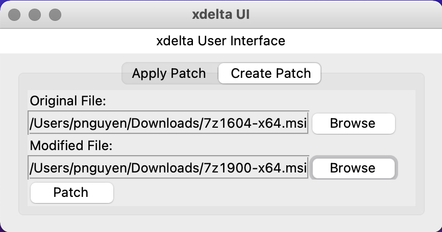

# python-xdelta3ui
Similar to xdeltaUI but written in Python so it works on multiple operating systems.

# Prerequsites
Before running script, install `xdelta3` first.

## Windows
Download `https://github.com/jmacd/xdelta-gpl/releases/download/v3.1.0/xdelta3-3.1.0-x86_64.exe.zip` extract to the same directory as `xdelta3ui.exe` and rename to `xdelta3.exe`

## Linux
`sudo apt-get xdelta`

## MacOS
`brew install xdelta`

# Instructions
Run the script from a terminal to get the user interface:  
Try `python xdelta3ui.py` (Windows) or `python3 xdelta3ui.py` (Linux / MacOS)

