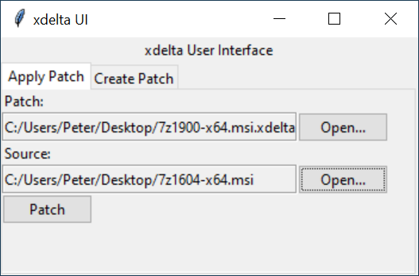
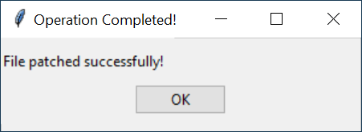

# python-xdelta3ui
Similar to xdeltaUI but written in Python so it works on multiple operating systems.

# Instructions
Run the script from a terminal to get the user interface:  
`python3 xdelta3ui.py`

